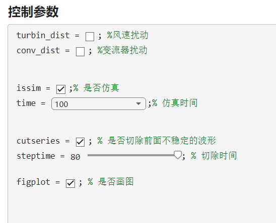
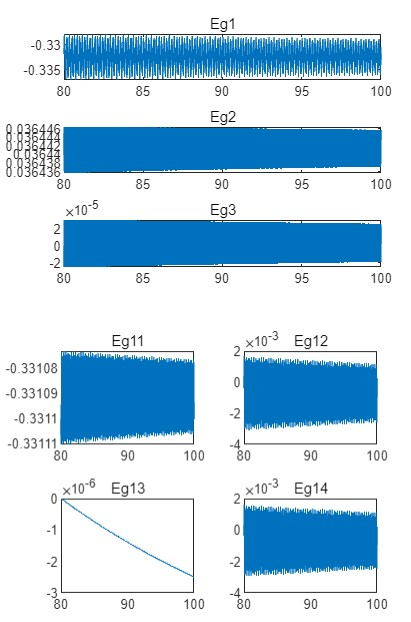
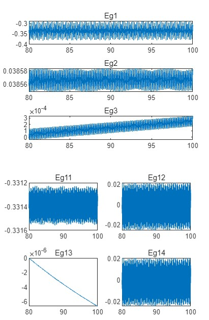
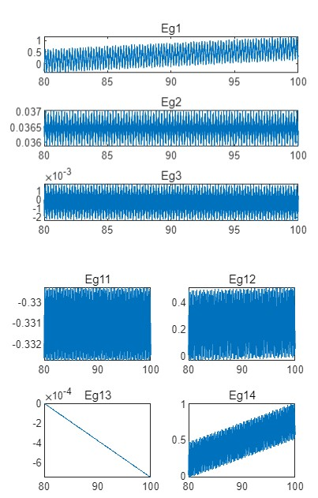

## 说明

 此demo用于DFIG在不同扰动情况下动态过程的仿真分析

主程序：`calEg.mlx`，仿真模型：`power_wind_dfig_avg.slx`

## 使用方法

1. 在主程序中修改控制参数：

2. 运行后生成仿真结果（以下为仿真结果示例）

   * 无扰动情况：

     

   * 风速扰动情况

     

   * 变流器扰动情况

     